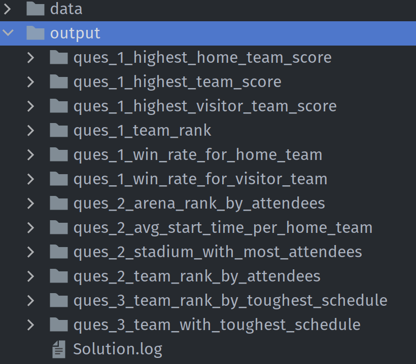

# NBA Analysis
## Theoretical problem:
Question 5: Let's assume we have all the historical data. The full historical data is 10GB (200MB per file for 50 files)
and you can use 5 computers with only 1 GB memory each. How can you answer question 1 by leveraging your 5 machines?

Solution: 
Lets distribute the data into logical blocks. 1 block = 2GB of data as we have 5 machines.
In other words each machine will process 2GB of data (1 block).
1 block will have 200 MB x 10 = 2000MB = 2GB
Total number of blocks = 5

But our machine has only 1 GB of memory and each block will be processed by each machine.
So we need to decide the partition size in such a way that we don't encounter an out of memory error. 
```scala
df.repartition(n)
```

If we use n = 4 then we will have one partition size = 2GB / 4 = 500MB.
This can be processed easily by one machine.

```scala
df.repartition(4)
```

This way spark will process whole 10GB by partitioning the data.

## Step to build and run the app:

- Build the project using `mvn clean install`
- This will create a jar in `target/nbaanalysis-1.0-SNAPSHOT.jar`
- Download spark 3.3.1 with scala 2.12.15 for using spark-submit. [Download link](https://www.apache.org/dyn/closer.lua/spark/spark-3.3.1/spark-3.3.1-bin-hadoop3.tgz)
- Extract the jar and go into the `spark-3.3.1-bin-hadoop3/bin` dir.
- The app has two required inputs:
  - `-f <data folder path>`
  - `-o <output folder path>`
- Run this command to execute the app:
  ```
  ./spark-submit --class io.marianasilvago.NbaAnalysisApp <path to project>/target/nbaanalysis-1.0-SNAPSHOT.jar -f <path to data folder> -o <path to output folder>
  ```


After running the above command you will see folders getting generated in output folder. Each folder contain a csv that 
has the answer for the respective questions.

You will also find the `Solution.log` that will contain a compiled solution for all the questions.